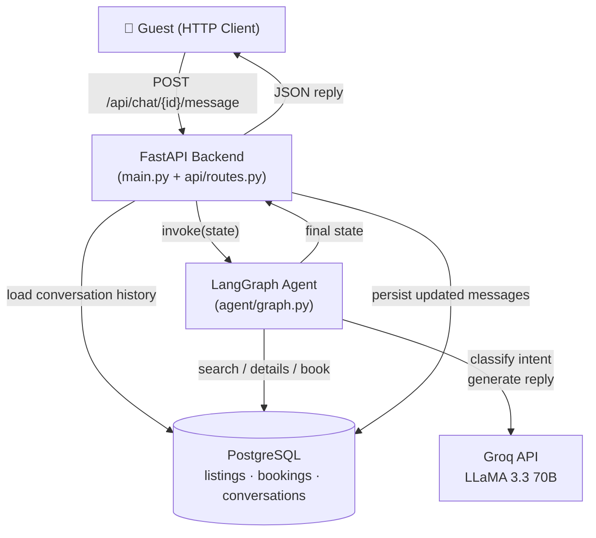
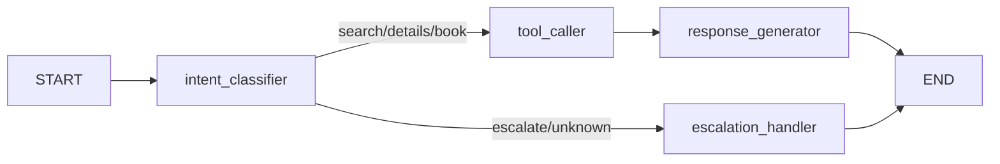

# StayEase AI Agent

AI-powered accommodation booking assistant for Bangladesh, built with FastAPI, LangGraph, PostgreSQL, and Groq (LLaMA 3.3 70B).

---

## 1.1 System Overview

The StayEase AI Agent is a conversational booking assistant that handles guest inquiries end-to-end across three capabilities: searching available properties, retrieving listing details, and creating bookings. A guest sends a message via the FastAPI REST API; the LangGraph agent classifies the intent, calls the appropriate tool (backed by a PostgreSQL database), generates a natural-language reply using the Groq-hosted LLaMA 3.3 70B model, and returns the response. Anything outside these three capabilities is escalated to a human agent. Conversation history is persisted in PostgreSQL so context is maintained across turns.




---

## 1.2 Conversation Flow

**Scenario:** Guest says — *"I need a room in Cox's Bazar for 2 nights for 2 guests"*

| Step | What happens |
|------|-------------|
| **1. HTTP Request** | Guest sends `POST /api/chat/conv-001/message` with `{"message": "I need a room in Cox's Bazar for 2 nights for 2 guests"}` |
| **2. Load history** | FastAPI queries the `conversations` table for `conv-001`. First message, so history is empty `[]`. |
| **3. Build state** | Initial `AgentState` is constructed with `user_message`, empty `messages`, and `conversation_id`. |
| **4. intent_classifier node** | LLM receives the message and a classification prompt. Returns `{"intent": "search", "extracted_params": {"location": "Cox's Bazar", "check_in": "2026-04-27", "check_out": "2026-04-29", "num_guests": 2}}`. State is updated. |
| **5. Conditional edge** | `route_by_intent` reads `intent == "search"` → routes to `tool_caller`. |
| **6. tool_caller node** | Calls `search_available_properties(location="Cox's Bazar", check_in=..., check_out=..., num_guests=2)`. Queries the `listings` table, filters out booked properties. Returns a list of available listings. State's `tool_result` is updated. |
| **7. response_generator node** | LLM receives the tool result and conversation history. Produces: *"আমি Cox's Bazar-এ 2 জনের জন্য 2 রাতের জন্য 3টি সম্পত্তি পেয়েছি: 1) Sea View Suite — BDT 4,500/রাত …"* |
| **8. Persist** | FastAPI writes the updated `messages` list to the `conversations` table. |
| **9. HTTP Response** | Guest receives `{"reply": "...", "intent": "search", "tool_result": {...}, "needs_escalation": false}` |

---

## 1.3 LangGraph State Design

```python
class AgentState(TypedDict):
    user_message: str          # Current guest message — input to intent_classifier
    messages: List[dict]       # Full conversation history — gives LLM context across turns
    conversation_id: str       # Session identifier — used to persist state in DB
    intent: Optional[str]      # Classified intent — controls conditional routing
    extracted_params: Optional[dict]  # Entities extracted from message — passed to tool
    tool_result: Optional[Any] # Raw tool output — input to response_generator
    response: Optional[str]    # Final reply text — returned to guest via API
    needs_escalation: bool     # Escalation flag — API uses this to alert human agents
```

| Field | Why it's needed |
|-------|----------------|
| `user_message` | Single source of truth for the current turn's input |
| `messages` | Enables multi-turn context without re-querying the DB mid-graph |
| `conversation_id` | Allows the API to persist state after the graph completes |
| `intent` | Drives the conditional edge that routes to the right node |
| `extracted_params` | Decouples extraction from tool invocation — cleaner node separation |
| `tool_result` | Passes structured data between tool_caller and response_generator |
| `response` | Single field the API reads to build its HTTP response |
| `needs_escalation` | Allows the API and downstream systems to trigger human handoff |

---

## 1.4 Node Design

### Node 1 — `intent_classifier`
**What it does:** Sends the user message to the LLM to classify intent and extract parameters (location, dates, listing ID, etc.).  
**Updates:** `intent`, `extracted_params`  
**Next node:** `tool_caller` (search/details/book) or `escalation_handler` (anything else)

---

### Node 2 — `tool_caller`
**What it does:** Invokes the correct tool function based on `intent`, passing `extracted_params` as arguments.  
**Updates:** `tool_result`  
**Next node:** `response_generator`

---

### Node 3 — `response_generator`
**What it does:** Passes `tool_result` and conversation history to the LLM to produce a natural-language guest reply.  
**Updates:** `response`, `messages`  
**Next node:** `END`

---

### Node 4 — `escalation_handler`
**What it does:** Sets `needs_escalation=True` and writes a bilingual (Bangla/English) handoff message when the intent is out of scope.  
**Updates:** `needs_escalation`, `response`, `messages`  
**Next node:** `END`

---

### Graph structure



---

## 1.5 Tool Definitions

### `search_available_properties`

**When used:** Intent is `search` and location + dates + guest count are present.

**Input:**
```python
location: str          # "Cox's Bazar"
check_in: date         # 2026-04-27
check_out: date        # 2026-04-29
num_guests: int        # 2
```

**Output:**
```json
{
  "available": true,
  "listings": [
    {
      "id": 1,
      "title": "Sea View Suite",
      "location": "Cox's Bazar",
      "price_per_night_bdt": 4500.0,
      "max_guests": 4,
      "type": "apartment"
    }
  ],
  "total_found": 1
}
```

---

### `get_listing_details`

**When used:** Intent is `details` and a `listing_id` is present.

**Input:**
```python
listing_id: int        # 1
```

**Output:**
```json
{
  "id": 1,
  "title": "Sea View Suite",
  "description": "Modern beachfront apartment with full sea view.",
  "location": "Cox's Bazar",
  "address": "Kolatoli Road, Cox's Bazar",
  "price_per_night_bdt": 4500.0,
  "max_guests": 4,
  "bedrooms": 2,
  "amenities": ["WiFi", "AC", "Hot water", "Parking"],
  "house_rules": "No smoking. Check-in after 2 PM.",
  "host_name": "Rahim Uddin",
  "host_phone": "+8801711000000"
}
```

---

### `create_booking`

**When used:** Intent is `book` and all booking parameters are confirmed.

**Input:**
```python
listing_id: int        # 1
guest_name: str        # "Fatema Khanam"
guest_phone: str       # "+8801812345678"
check_in: date         # 2026-04-27
check_out: date        # 2026-04-29
num_guests: int        # 2
```

**Output:**
```json
{
  "success": true,
  "booking_id": 1001,
  "total_cost_bdt": 9000.0,
  "message": "Booking confirmed for Fatema Khanam. 2 night(s) at BDT 4500.0/night. Total: BDT 9000.0."
}
```

---


## 1.6 Database Schema

### `listings`

| Column | Type | Notes |
|--------|------|-------|
| `id` | `SERIAL PRIMARY KEY` | Auto-increment |
| `title` | `VARCHAR(255)` | Property name |
| `description` | `TEXT` | Full description |
| `location` | `VARCHAR(100)` | City / area |
| `address` | `VARCHAR(500)` | Street address |
| `property_type` | `VARCHAR(50)` | apartment / house / room |
| `price_per_night_bdt` | `FLOAT` | Must be > 0 |
| `max_guests` | `INTEGER` | Capacity |
| `bedrooms` | `INTEGER` | Number of bedrooms |
| `amenities` | `JSON` | `["WiFi", "AC", ...]` |
| `house_rules` | `TEXT` | Host rules |
| `host_name` | `VARCHAR(100)` | Host full name |
| `host_phone` | `VARCHAR(20)` | Host contact |
| `is_active` | `INTEGER` | 1 = listed, 0 = delisted |
| `created_at` | `TIMESTAMP` | Record creation time |

---

### `bookings`

| Column | Type | Notes |
|--------|------|-------|
| `id` | `SERIAL PRIMARY KEY` | Auto-increment |
| `listing_id` | `INTEGER FK → listings.id` | Which property |
| `conversation_id` | `VARCHAR(100)` | Links to chat session |
| `guest_name` | `VARCHAR(100)` | Guest full name |
| `guest_phone` | `VARCHAR(20)` | Guest contact |
| `check_in` | `DATE` | Arrival date |
| `check_out` | `DATE` | Departure date |
| `num_guests` | `INTEGER` | Must be > 0 |
| `total_cost_bdt` | `FLOAT` | Nights × price |
| `status` | `VARCHAR(20)` | confirmed / cancelled |
| `created_at` | `TIMESTAMP` | Booking creation time |

---

### `conversations`

| Column | Type | Notes |
|--------|------|-------|
| `id` | `VARCHAR(100) PRIMARY KEY` | UUID supplied by client |
| `messages` | `JSON` | `[{"role": "user"/"assistant", "content": "..."}]` |
| `needs_escalation` | `INTEGER` | 0 = false, 1 = true |
| `created_at` | `TIMESTAMP` | Session start time |
| `updated_at` | `TIMESTAMP` | Last message time |

---

## Setup & Running

```bash
# 1. Clone and enter the repo
git clone https://github.com/your-username/stayease-agent
cd stayease-agent

# 2. Create and activate a virtual environment
python -m venv venv
venv\Scripts\activate        # Windows
# source venv/bin/activate   # Linux/Mac

# 3. Install dependencies
pip install -r requirements.txt

# 4. Configure environment
copy .env.example .env       # Windows
# cp .env.example .env       # Linux/Mac
# Edit .env and add your GROQ_API_KEY and DATABASE_URL

# 5. Start PostgreSQL and create the database
# (PostgreSQL must be running)
# psql -U postgres -c "CREATE DATABASE stayease;"

# 6. Run the server
uvicorn main:app --reload
```

API docs available at: `http://localhost:8000/docs`

---

## Project Structure

```
stayease/
├── agent/
│   ├── __init__.py
│   ├── state.py       # AgentState TypedDict
│   ├── nodes.py       # Node functions + routing logic
│   ├── tools.py       # Tool definitions with Pydantic schemas
│   └── graph.py       # Graph construction and compilation
├── api/
│   ├── __init__.py
│   ├── models.py      # SQLAlchemy ORM models
│   ├── database.py    # DB engine, session, init_db
│   ├── schemas.py     # Pydantic request/response schemas
│   └── routes.py      # FastAPI route handlers
├── main.py            # FastAPI app entry point
├── requirements.txt
├── .env.example
└── README.md
```
